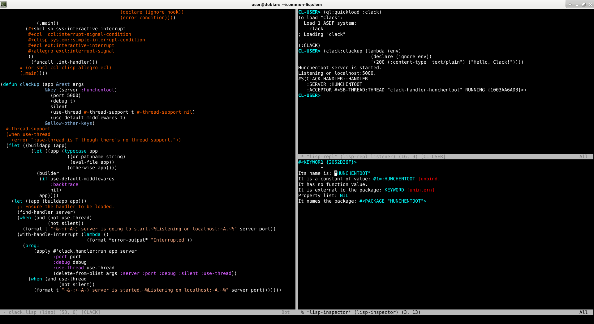

# lem : the editor for Common Lispers

## Screenshots
Terminal(default)

　　


Electron version(bata, in progress)
　　

[](#backers) [](#sponsors)

## What is lem?
Lem is the editor for Common Lispers.

Lem makes it possible to develop in Common Lisp the moment you've installed it. 

You don't need any tidy setting or install any other plugins.

You can write the setting and even write your original plugin in Common Lisp.

## Vision
- To make Better, Faster, Stronger CL development environment
- To combine Common Lisp with Web ecosystem
- To generate Common Lisp application with just one click

## Requirement
- [roswell](https://github.com/roswell/roswell)
- ncurses

## Platform
- Linux
- MacOS 10.13+ 

## Installation
```
$ ros install cxxxr/lem
```

## Usage
If you add the PATH, you can start using lem at once!
```
$ lem
```
You can also start lem on roswell's REPL.
```
$ ros run
CL-USER> (ql:quickload :lem)
CL-USER> (lem:lem)
```

## Notes
- If you use Rasberry Pi, you need to use CCL(Clozure Common Lisp).  
Please change the CL implementation to CCL as follow:
```
$ ros use ccl-bin
```

## Contributors

This project exists thanks to all the people who contribute. [[Contribute]](CONTRIBUTING.md).
<a href="graphs/contributors"></a>


## Backers

Thank you to all our backers! 🙏 [[Become a backer](https://opencollective.com/lem#backer)]

<a href="https://opencollective.com/lem#backers" target="_blank"></a>


## Sponsors

Support this project by becoming a sponsor. Your logo will show up here with a link to your website. [[Become a sponsor](https://opencollective.com/lem#sponsor)]

<a href="https://opencollective.com/lem/sponsor/0/website" target="_blank"></a>
<a href="https://opencollective.com/lem/sponsor/1/website" target="_blank"></a>
<a href="https://opencollective.com/lem/sponsor/2/website" target="_blank"></a>
<a href="https://opencollective.com/lem/sponsor/3/website" target="_blank"></a>
<a href="https://opencollective.com/lem/sponsor/4/website" target="_blank"></a>
<a href="https://opencollective.com/lem/sponsor/5/website" target="_blank"></a>
<a href="https://opencollective.com/lem/sponsor/6/website" target="_blank"></a>
<a href="https://opencollective.com/lem/sponsor/7/website" target="_blank"></a>
<a href="https://opencollective.com/lem/sponsor/8/website" target="_blank"></a>
<a href="https://opencollective.com/lem/sponsor/9/website" target="_blank"></a>


# License
[MIT](https://github.com/cxxxr/lem/blob/master/LICENCE)
